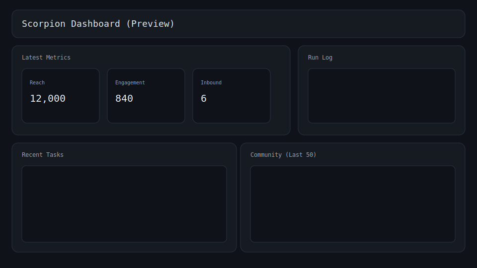

# Scorpion Lab

Public code samples and experiments for RevenueCat integration, focused on fitness, education, and creator tools.

## Contents (planned)
- Posts and experiment logs
- iOS paywall examples
- Android offer testing
- Flutter and React Native integrations
- Webhooks + backend sync patterns
- Charts API usage

## Status
Early build. Samples will be added incrementally.

## Latest
- Post: posts/fitness-paywall-swiftui.md
- Example: ios/fitness-paywall-swiftui
- Experiment: experiments/fitness-trial-vs-no-trial.md

## Dashboard Preview

## Discord Integration
The agent posts content to a sandbox Discord channel using a bot token. See `agentic-rc/agent/scorpion/docs/sandbox_readme.md` for setup.
